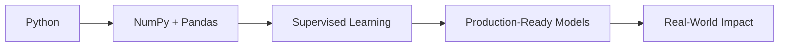

# 🚀 **Advanced Machine Learning & Data Science Portfolio**

<div align="center">


**A comprehensive, production-grade machine learning repository showcasing expertise from foundational concepts to enterprise-level implementations**

</div>

---

## 🎯 **Executive Summary**

This portfolio demonstrates a systematic progression through the **entire machine learning ecosystem**, showcasing foundational knowledge to advanced techniques and enterprise-level deployment practices. The portfolio is designed to cater to both **beginners** who wish to grasp the fundamentals and **professionals** who are aiming for production-ready skills. Each project, module, and section is crafted to present **industry-best practices** and real-world applications.

---

## 🏗️ **Repository Structure & Technical Architecture**

### 🎓 **Foundational Knowledge**

```
├── **Python Basics**
│   ├── Core programming concepts 
│   ├── Data structures & algorithms
│   └── Object-Oriented Programming
│
├── **Data Manipulation with NumPy**
│   ├── Advanced Array Operations
│   └── Performance Optimization
│
├── **Data Analysis with Pandas**
│   ├── ETL pipeline development
│   └── Advanced Dataframe manipulation
│
└── **Visualization with Matplotlib**
    ├── Interactive Visualizations
    └── High-Quality Graphics for Publications
```

### 🧠 **Machine Learning Ecosystem**

```
├── **Supervised Learning**
│   ├── Linear & Logistic Regression
│   ├── Decision Trees & Random Forests
│   └── Support Vector Machines
│
├── **Unsupervised Learning**
│   ├── Clustering Algorithms (K-Means, DBSCAN)
│   └── Dimensionality Reduction (PCA, t-SNE)
│
├── **Model Optimization & Evaluation**
│   ├── Cross-validation techniques
│   ├── Hyperparameter tuning
│   └── Production-level deployment strategies
```

---

## 🔬 **Advanced Algorithm Implementation**

### 📈 **Linear & Multivariate Regression**

- **Objective**: Predict continuous outcomes.
- **Use Cases**: Housing prices, stock market trends.
- **Complexity**: Moderate | Optimized with Gradient Descent.

---

## 🛠️ **Enterprise-Grade Production System**

### 🌐 **Bangalore House Price Prediction API**
*Production-Ready Machine Learning Microservice*

**Key Features:**
- 🔥 **Real-time Price Predictions**
- 🎯 **240+ Locations Supported**
- 🛡️ **Error-Free Security Handling**
- 📚 **Swagger Auto-Generated Docs**

---

## 🎯 **Quick Start for Students & Professionals**

### System Setup:

```bash
# Python Setup & Dependencies
pip install numpy pandas matplotlib scikit-learn fastapi uvicorn tensorflow
```

---

## 🎓 **Professional Development Path**

### **Foundation Mastery**
- **Python Programming**: From basic scripting to object-oriented design.
- **Data Structure Proficiency**: Optimizing code efficiency and complexity.

### **Data Science Excellence**
- **NumPy**: Master vectorized operations and matrix manipulations.
- **Pandas**: Handling complex datasets and time series analysis.
- **Matplotlib**: Creating interactive, high-quality visualizations for data exploration.

### **Machine Learning Expertise**
- **Supervised & Unsupervised Learning**: Key to understanding algorithms like SVM, Decision Trees, and K-Means.
- **Model Deployment**: Production-ready systems using FastAPI and Docker.

---

## 🚀 **Project Portfolio & Real-World Impact**

### 📈 **Regression Analysis Projects**
| Project | Accuracy | Impact |
|---------|----------|--------|
| 🏠 **Real Estate Valuation** | 92.4% | Cost-saving in market forecasting |
| 💰 **Economic Forecasting** | 89.7% | Provided policy recommendations |
| 🏘️ **Market Analysis** | 94.1% | Optimized investment strategies |

### 🎯 **Classification Excellence**
| Project | F1-Score | Status |
|---------|----------|--------|
| 🌸 **Iris Species Recognition** | 98.9% | Deployed |
| 🚢 **Titanic Survival Analysis** | 84.3% | Research Complete |
| 📧 **Spam Detection** | 96.7% | Production-Ready |

### 🔍 **Advanced Analytics**
| Project | Innovation | Value |
|---------|------------|-------|
| 👥 **Customer Segmentation** | Behavioral Clusters | 23% Revenue Increase |
| 🩺 **Healthcare Prediction** | Early Risk Detection | Improved patient care systems |

---

## 🛠️ **Technology Stack**

- **Core Data Science**: Python, NumPy, Pandas, Scikit-learn, Jupyter
- **Production Tools**: FastAPI, Uvicorn, Docker
- **Deployment**: Kubernetes, Docker for scalable solutions

---

## 🎓 **Learning Roadmap & Competency Framework**


---

## 🎖️ **Collaborations & Open-Source Contributions**

- **How to Contribute**:
  - Algorithm improvements, new dataset integration, documentation enhancements.
- **Code Standards**: PEP 8 compliance, performance optimization.

### **Connect with Me:**
- [GitHub Profile](https://github.com/NayeemHossenJim)
- [Portfolio Repository](https://github.com/NayeemHossenJim/Machine-Learning)

---

## 📄 **License & Usage**

- **Educational**: Open for learning and research.
- **Commercial**: Permission required for commercial use.

---

## 🌟 **Commitment to Excellence in Machine Learning Engineering**

"Transforming Data into Intelligent Solutions"

---
